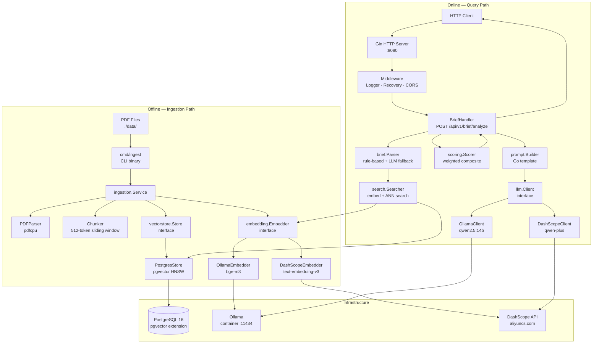
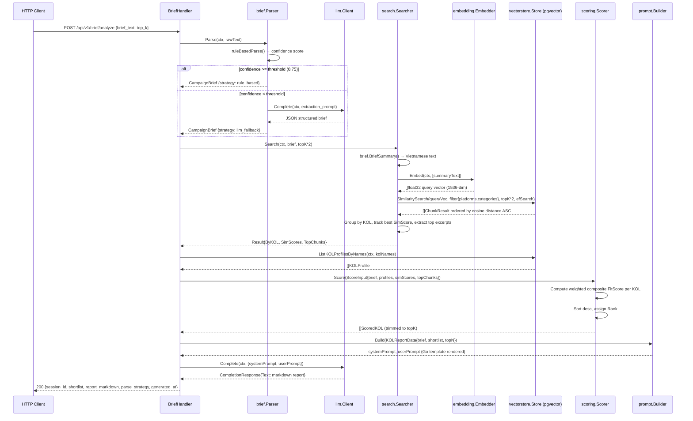
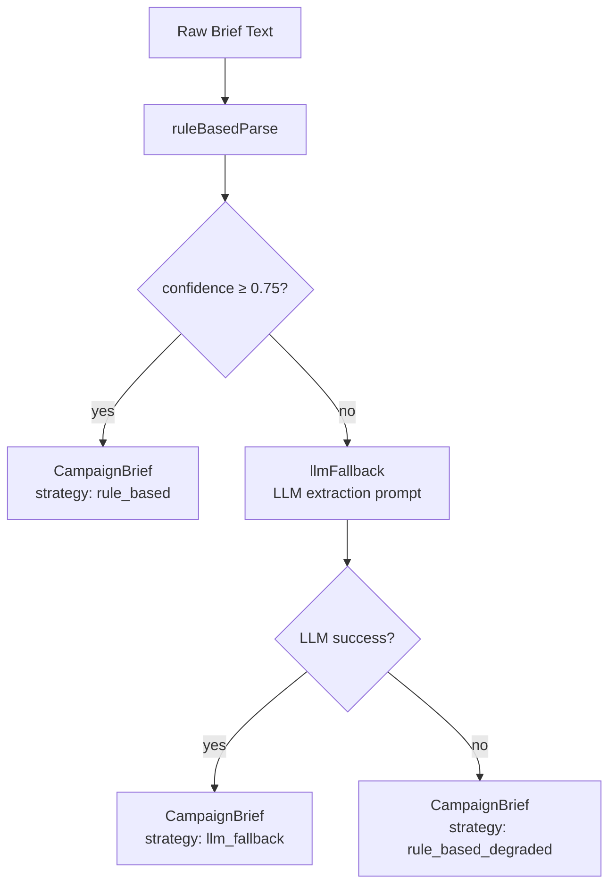

# System Architecture — KolSense RAG Platform

> **Internal Engineering Documentation** — v1.0 — Generated 2026-05-15
> Language: Go 1.25 | Database: PostgreSQL 16 + pgvector | AI: Ollama / DashScope

---

## 1. Project Overview

KolSense is a **Key Opinion Leader (KOL) matching and recommendation platform** built for the Vietnamese influencer marketing market. It solves the problem of manually matching brand campaign briefs to relevant KOLs by automating discovery through a three-tier RAG (Retrieval-Augmented Generation) pipeline.

### Core Business Flow
A marketer pastes a free-text campaign brief (Vietnamese or English) → the system extracts structured intent → embeds the intent → retrieves semantically similar KOL document chunks → scores KOL candidates → asks an LLM to produce a Vietnamese-language recommendation report.

### Tech Stack Summary

| Layer | Technology |
|---|---|
| Language | Go 1.25 (module: `kolsense`) |
| HTTP Framework | Gin v1.12 |
| Vector Database | PostgreSQL 16 + pgvector (HNSW index) |
| DB Driver | pgx/v5 + pgxpool |
| Embedding – Local | Ollama `/api/embed` (bge-m3, 1536-dim) |
| Embedding – Cloud | Alibaba DashScope `text-embedding-v3` |
| LLM – Local | Ollama `/api/chat` (qwen2.5:14b) |
| LLM – Cloud | DashScope `qwen-plus` (OpenAI-compatible) |
| PDF Parsing | pdfcpu |
| Config | Viper (env-file + OS env) |
| Logging | Uber Zap (structured JSON) |
| Container | Docker / docker compose |

---

## 2. High-Level Architecture



---

## 3. Core Components

### 3.1 Package Map

```
kolsense/
├── cmd/
│   ├── api/main.go          # HTTP server entrypoint — DI wiring, graceful shutdown
│   └── ingest/main.go       # CLI entrypoint — batch PDF ingestion
└── internal/
    ├── config/config.go     # Viper-based config, validation, defaults
    ├── api/
    │   ├── server.go        # Gin engine, route registration, CORS
    │   ├── handlers/
    │   │   ├── brief.go     # POST /brief/analyze — full RAG pipeline
    │   │   ├── kol.go       # GET /kol/:name — profile lookup
    │   │   └── ingest.go    # POST /ingest/pdf — API-triggered ingestion
    │   └── middleware/
    │       └── middleware.go# Structured request logger + panic recovery
    ├── embedding/
    │   ├── embedder.go      # Embedder interface (contract)
    │   ├── ollama.go        # OllamaEmbedder (local dev)
    │   └── dashscope.go     # DashScopeEmbedder (production)
    ├── llm/
    │   ├── client.go        # Client interface (contract)
    │   ├── ollama.go        # OllamaClient — non-streaming + goroutine streaming
    │   └── dashscope.go     # DashScopeClient — SSE streaming, OpenAI-compat
    ├── vectorstore/
    │   ├── store.go         # Store interface + domain types (Chunk, KOLProfile…)
    │   ├── postgres.go      # PostgresStore — pgxpool, HNSW search, upserts
    │   └── migrations/
    │       └── 001_init.sql # Schema: kol_profiles, kol_chunks, brief_sessions
    ├── ingestion/
    │   ├── service.go       # Pipeline orchestrator: PDF→chunks→embed→store
    │   ├── pdf_parser.go    # pdfcpu wrapper, temp-dir page extraction, fallback
    │   └── chunker.go       # Sliding-window chunker, UTF-8 normalization
    ├── brief/
    │   ├── models.go        # CampaignBrief, Platform, Category, BudgetRange…
    │   └── parser.go        # Hybrid parser: regex rules + LLM JSON fallback
    ├── search/
    │   └── searcher.go      # Brief embed → ANN → group-by-KOL → excerpts
    ├── scoring/
    │   ├── models.go        # Weights, ScoreBreakdown, ScoredKOL
    │   └── scorer.go        # Weighted composite scorer + budget fit function
    └── prompt/
        └── builder.go       # Go text/template — system prompt + user context
```

### 3.2 Interfaces (Contracts)

The system defines three explicit Go interfaces that decouple implementations from consumers:

**`embedding.Embedder`**
```go
type Embedder interface {
    Embed(ctx context.Context, texts []string) ([][]float32, error)
    Dimensions() int
}
```
Implemented by: `OllamaEmbedder`, `DashScopeEmbedder`.

**`llm.Client`**
```go
type Client interface {
    Complete(ctx context.Context, req CompletionRequest) (CompletionResponse, error)
    Stream(ctx context.Context, req CompletionRequest) (<-chan string, error)
}
```
Implemented by: `OllamaClient`, `DashScopeClient`.

**`vectorstore.Store`**
```go
type Store interface {
    UpsertChunks(ctx context.Context, chunks []Chunk) error
    SimilaritySearch(ctx context.Context, queryVec []float32, filter SearchFilter, topK, efSearch int) ([]ChunkResult, error)
    UpsertKOLProfile(ctx context.Context, profile KOLProfile) error
    GetKOLProfile(ctx context.Context, name string) (*KOLProfile, error)
    ListKOLProfilesByNames(ctx context.Context, names []string) ([]KOLProfile, error)
    Close()
}
```
Implemented by: `PostgresStore`.

---

## 4. Request Lifecycle

### POST /api/v1/brief/analyze — Full RAG Pipeline



### Other Endpoints

| Method | Path | Handler | Notes |
|---|---|---|---|
| GET | `/api/v1/health` | inline | Returns `{status:"ok", ts:...}` |
| GET | `/api/v1/kol/:name` | `KOLHandler.GetProfile` | Direct DB lookup, 404 on missing |
| POST | `/api/v1/ingest/pdf` | `IngestHandler.IngestPDF` | API-triggered ingestion, synchronous |
| GET | `/api/v1/brief/:id/report` | `BriefHandler.GetReport` | **Stub** — returns 501 Not Implemented |

---

## 5. Data Ingestion Pipeline

The ingestion pipeline runs either as a **CLI binary** (`cmd/ingest`) or is triggered via **HTTP** (`POST /ingest/pdf`). Both paths converge in `ingestion.Service`.

### Pipeline Steps

```mermaid
flowchart LR
    A[PDF File on Disk] --> B[PDFParser.ParseFile]
    B --> B1{Primary Extract<br/>api.ExtractContentFile}
    B1 -->|success| C[readExtractedPages<br/>tmpDir *.txt files]
    B1 -->|error| B2[fallbackExtract<br/>api.ExtractPagesFile]
    B2 --> C
    C --> D[[]PageText<br/>pageNum + text]
    D --> E[Chunker.Chunk per page<br/>512-token sliding window<br/>64-token overlap]
    E --> F[[]rawChunk<br/>text + pageNum + tokenCount]
    F --> G[Batch loop — 32 chunks/batch]
    G --> H[Embedder.Embed<br/>batch of texts]
    H --> I[[][]float32 vectors]
    I --> J[Assemble vectorstore.Chunk<br/>KOLName, DocType, SourceFile,<br/>PageNum, Text, Embedding]
    J --> K[Store.UpsertChunks<br/>single DB transaction]
    K --> L[n chunks stored]
```

### KOL Name & DocType Inference

When not explicitly supplied, the CLI derives them from the filename:

- **KOL name**: double-underscores `__` become ` — `, single underscores become spaces.  
  `Lumire_Collective__KOL_Performance_Analytics.pdf` → `Lumire Collective — KOL Performance Analytics`
- **DocType**: keyword matching on lowercase filename:
  - `campaign|report` → `campaign_report`
  - `performance|analytics` → `kol_performance`
  - `audience|insight` → `audience_insight`
  - `brand|guideline` → `brand_guideline`
  - default: `campaign_report`

### Chunker Design

- **Strategy**: sliding window over whitespace-tokenized words.
- **Window**: 512 tokens (words); **Overlap**: 64 tokens (12.5% of window).
- **Step** = 512 - 64 = 448 words per advance.
- Invalid UTF-8 sequences are replaced before processing.
- Token approximation is whitespace-split word count — not a true BPE tokenizer.

### Embedding Batching

Chunks are embedded in batches of **32** (configurable via `IngestConfig.EmbedBatch`). The loop is synchronous; no parallelism between batches.

---

## 6. RAG Retrieval Pipeline

### Phase 1 — Brief Parsing (Hybrid Strategy)



**Rule-based extraction** uses pre-compiled `regexp.MustCompile` patterns (compiled once at package init) for:
- Platforms: TikTok, Instagram, YouTube, Facebook
- Categories: beauty/làm đẹp, fashion/thời trang, lifestyle, tech/công nghệ, food/ẩm thực, fitness, travel/du lịch
- Goals: awareness, conversion/bán hàng, engagement/tương tác, branding
- Budget: VND range or single value with triệu/tỷ/million/billion suffixes
- Gender: nữ/female, nam/male
- Age: `tuổi|age DD–DD` pattern

**Confidence** = `fields_found / 6` (6 signals evaluated). If < 0.75, LLM fallback fires.

**LLM fallback** sends a Vietnamese system prompt requesting JSON-only output. The response is sanitized (markdown fences stripped, first `{...}` extracted) before `json.Unmarshal`.

### Phase 2 — Semantic Search

1. `BriefSummary()` renders the parsed brief into Vietnamese prose suitable for embedding.
2. The summary is embedded via the configured `Embedder` (single-item batch).
3. `SimilaritySearch` executes HNSW cosine ANN against `kol_chunks`, filtered by platform and category array overlap (`&&` operator on PostgreSQL arrays).
4. Results are ordered by cosine **distance** ascending (0 = identical, 2 = opposite).
5. `SimScore = 1.0 - distance / 2.0` normalises distance into `[0, 1]`.

### Phase 3 — Scoring & Reranking

The `scoring.Scorer` applies a weighted linear combination:

```
FitScore = 0.40 * Similarity
         + 0.25 * Engagement (normalised within candidate set)
         + 0.20 * ROI (normalised within candidate set)
         + 0.10 * BudgetFit
         + 0.05 * AudienceMatch (hardcoded 0.5 — placeholder)
```

**BudgetFit** logic:
- KOL fee unknown → 0.5
- No budget constraint → 0.5
- `fee_max ≤ brief_max` → 1.0
- `fee_max > brief_max` → `1.0 - (fee_max - brief_max) / brief_max` (linear decay, floor 0)

### Phase 4 — Prompt Construction & LLM Generation

`prompt.Builder` renders a Go `text/template` combining:
- Structured brief fields (category, platform, goal, budget, audience)
- Top-N KOL entries with fit score, engagement %, ROI, fee range, score breakdown, and up to 2 text excerpts from retrieved chunks

The rendered context is passed as the user prompt; the LLM (Qwen) is instructed (system prompt) to produce a Vietnamese-language recommendation report covering shortlist rationale, strengths/weaknesses, budget allocation, risks, and final recommendation.

---

## 7. Embedding System

### Embedder Interface

Both implementations satisfy `embedding.Embedder`. Selection is done at startup via a `switch` on `cfg.Embedding.Provider`.

### OllamaEmbedder

- Endpoint: `POST {OLLAMA_BASE_URL}/api/embed`
- Request: `{model, input: []string}` — native batch API
- Timeout: **120 seconds** (allows large batch calls)
- Validates response count matches input count
- Concurrency-safe: stateless, each call creates an independent HTTP request

### DashScopeEmbedder

- Endpoint: `https://dashscope.aliyuncs.com/api/v1/services/embeddings/text-embedding/text-embedding`
- Auth: `Authorization: Bearer {DASHSCOPE_API_KEY}`
- Request: `{model, input: {texts: []string}}`
- Supports batches up to 25 per Alibaba limit (not enforced client-side — **risk**)
- Returns embeddings keyed by `text_index`; re-sorted to input order
- Timeout: **60 seconds**

### Embedding Dimensions

Fixed at **1536** across providers (configured via `EMBEDDING_DIMENSIONS`). The `VECTOR(1536)` column type and HNSW index are created with this dimension at migration time.

> **Risk**: Changing `EMBEDDING_DIMENSIONS` requires dropping and rebuilding the entire HNSW index. There is no dimension mismatch guard at runtime.

---

## 8. Vector Database Architecture

### Schema Design

```sql
-- Master KOL registry
CREATE TABLE kol_profiles (
    id              UUID PRIMARY KEY DEFAULT uuid_generate_v4(),
    name            TEXT NOT NULL UNIQUE,
    platform        TEXT[],           -- GIN indexed
    category        TEXT[],           -- GIN indexed
    avg_engagement  FLOAT,
    avg_reach       BIGINT,
    avg_roi         FLOAT,
    follower_count  BIGINT,
    fee_min_vnd     BIGINT,
    fee_max_vnd     BIGINT,
    metadata        JSONB,
    updated_at      TIMESTAMPTZ DEFAULT NOW()
);

-- Document chunks with pgvector embedding
CREATE TABLE kol_chunks (
    id          UUID PRIMARY KEY DEFAULT uuid_generate_v4(),
    kol_name    TEXT REFERENCES kol_profiles(name) ON DELETE CASCADE,
    doc_type    TEXT,     -- campaign_report|kol_performance|audience_insight|brand_guideline
    source_file TEXT,
    page_num    INT,
    text        TEXT,
    token_count INT,
    embedding   VECTOR(1536),  -- HNSW indexed
    metadata    JSONB,
    created_at  TIMESTAMPTZ DEFAULT NOW()
);

-- Session storage (defined, not yet written to)
CREATE TABLE brief_sessions (
    id              UUID PRIMARY KEY DEFAULT uuid_generate_v4(),
    raw_text        TEXT,
    parsed_brief    JSONB,
    shortlist       JSONB,
    report_markdown TEXT,
    parser_strategy TEXT,
    created_at      TIMESTAMPTZ DEFAULT NOW()
);
```

### Index Strategy

| Index | Type | Purpose |
|---|---|---|
| `idx_kol_chunks_embedding` | HNSW (`vector_cosine_ops`) | ANN similarity search |
| `idx_kol_profiles_platform` | GIN | Array containment filter `&&` |
| `idx_kol_profiles_category` | GIN | Array containment filter `&&` |
| `idx_kol_chunks_kol_name` | B-tree | Cascade delete, JOIN |
| `idx_kol_chunks_doc_type` | B-tree | Future doc_type filtering |

### HNSW Parameters

```sql
USING hnsw (embedding vector_cosine_ops)
WITH (m = 16, ef_construction = 128)
```

- `m=16`: each node connects to 16 neighbours during construction — balanced between recall and memory (~1.5× overhead vs. flat search).
- `ef_construction=128`: higher build-time recall; trades index build time for quality.
- Query-time `ef_search=64` (default): controlled per-query via `SET LOCAL hnsw.ef_search`.

### Similarity Search Query

```sql
SELECT c.id, c.kol_name, c.doc_type, c.source_file, c.page_num,
       c.text, c.token_count, c.metadata, c.created_at,
       c.embedding <-> $1 AS distance
FROM kol_chunks c
JOIN kol_profiles p ON p.name = c.kol_name
WHERE
    ($2::text[] IS NULL OR p.platform && $2) AND
    ($3::text[] IS NULL OR p.category && $3)
ORDER BY distance ASC
LIMIT $4
```

The `<->` operator is pgvector's cosine distance operator. The `JOIN` to `kol_profiles` enables metadata pre-filtering before ANN, which is PostgreSQL's **post-filter** model (not true pre-filter).

> **Scalability Note**: At large vector counts, the metadata JOIN can degrade HNSW recall because pgvector applies ANN first, then filters. A KOL with matching metadata may be beyond the HNSW scan radius. True pre-filtering would require partition-per-category indexing.

### Connection Pool

`pgxpool` manages connections:
- **MaxConns**: 20 (configurable)
- **MinConns**: 2
- Connection string from `DATABASE_URL` env var

---

## 9. LLM Integration

### Client Interface

Both LLM clients implement:

```go
type Client interface {
    Complete(ctx context.Context, req CompletionRequest) (CompletionResponse, error)
    Stream(ctx context.Context, req CompletionRequest) (<-chan string, error)
}
```

`CompletionResponse` includes `InputTokens` and `OutputTokens` (only populated by DashScope; Ollama returns 0).

### OllamaClient

- Endpoint: `POST {OLLAMA_BASE_URL}/api/chat`
- Protocol: Ollama native JSON chat format
- Non-streaming: `stream: false` — single JSON decode
- Streaming: `stream: true` — goroutine reads `bufio.Scanner` line-by-line, pushes content chunks to `chan string` (buffer: 64)
- Timeout: **300 seconds** (5 min — accommodates large model inference)
- Context cancellation propagated via `select { case ch <- token: case <-ctx.Done(): return }`

### DashScopeClient

- Endpoint: `https://dashscope.aliyuncs.com/compatible-mode/v1/chat/completions`
- Protocol: **OpenAI-compatible** format — drop-in replacement path
- Non-streaming: standard JSON decode
- Streaming: SSE (`text/event-stream`), strips `data:` prefix, handles `[DONE]` sentinel
- Timeout: **180 seconds**
- Per-request `MaxTokens` and `Temperature` override instance defaults (zero-value fallback to instance config)

### LLM Usage in the System

| Usage Point | Mode | Caller |
|---|---|---|
| Brief extraction (LLM fallback) | Non-streaming | `brief.Parser.llmFallback` |
| KOL report generation | Non-streaming | `BriefHandler.Analyze` |
| `Stream` method | Available | Not called in current API handlers |

> The `Stream` method is implemented but **not yet wired** to any HTTP streaming endpoint (no SSE route exists). This is future infrastructure.

---

## 10. API Layer

### Server Initialization

`api.New()` performs constructor injection:
1. Receives pre-built `Dependencies{Store, Embedder, LLM}` from `cmd/api/main.go`
2. Constructs service-layer objects (Parser, Searcher, Scorer, PromptBuilder, IngestService)
3. Registers middleware and routes on Gin engine
4. Returns `*Server` wrapping the engine

### Middleware Stack (in order)

1. **Logger** (`middleware.Logger`): structured Zap logging of every request — status, method, path, query, IP, latency, body size. Severity-routing: 5xx→Error, 4xx→Warn, 2xx→Info.
2. **Recovery** (`middleware.Recovery`): Gin panic recovery, logs with Zap, returns `500 {"error": "internal server error"}`.
3. **CORS** (inline `corsMiddleware`): permissive — `Access-Control-Allow-Origin: *`, handles OPTIONS preflight with 204.

### Route Table

```
GET  /api/v1/health              → healthHandler (inline)
POST /api/v1/brief/analyze       → BriefHandler.Analyze
GET  /api/v1/brief/:id/report    → BriefHandler.GetReport  [501 STUB]
GET  /api/v1/kol/:name           → KOLHandler.GetProfile
POST /api/v1/ingest/pdf          → IngestHandler.IngestPDF
```

### Server Configuration

```go
http.Server{
    Addr:         cfg.Server.Addr(),   // HOST:PORT
    Handler:      engine,
    ReadTimeout:  30 * time.Second,
    WriteTimeout: 60 * time.Second,
    IdleTimeout:  120 * time.Second,
}
```

### Graceful Shutdown

`cmd/api/main.go` registers `SIGINT`/`SIGTERM` handlers. On signal:
1. `httpSrv.Shutdown(ctx)` with 30-second timeout — drains in-flight requests
2. `store.Close()` releases the connection pool (deferred)
3. `log.Sync()` flushes Zap buffer (deferred)

### Session ID Generation

```go
func generateID() string {
    return "sess_" + time.Now().Format("20060102150405")
}
```

> **Risk**: Time-based session IDs are not unique under concurrent requests at sub-second granularity. Session persistence is not implemented (`brief_sessions` table exists but is never written to). `GET /brief/:id/report` returns 501.
